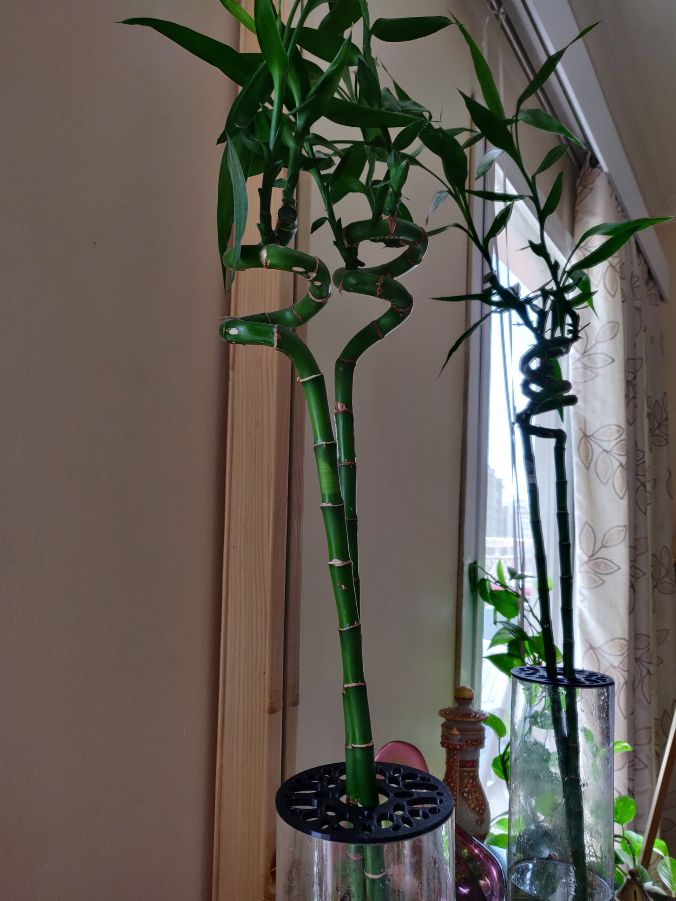
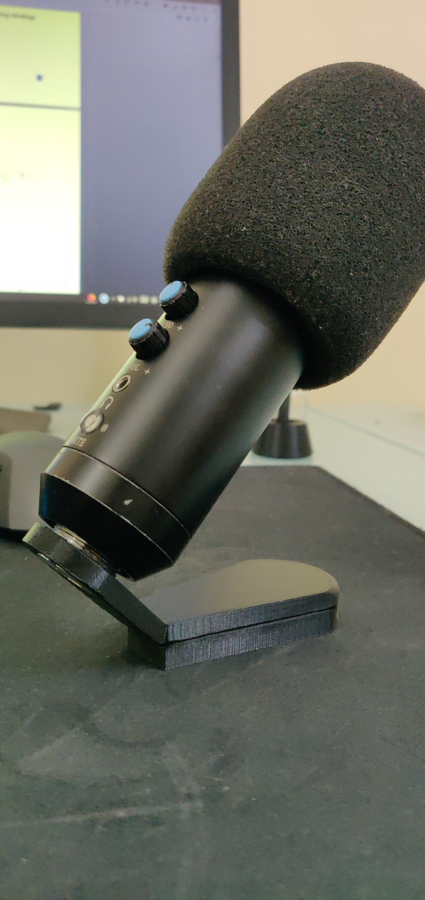
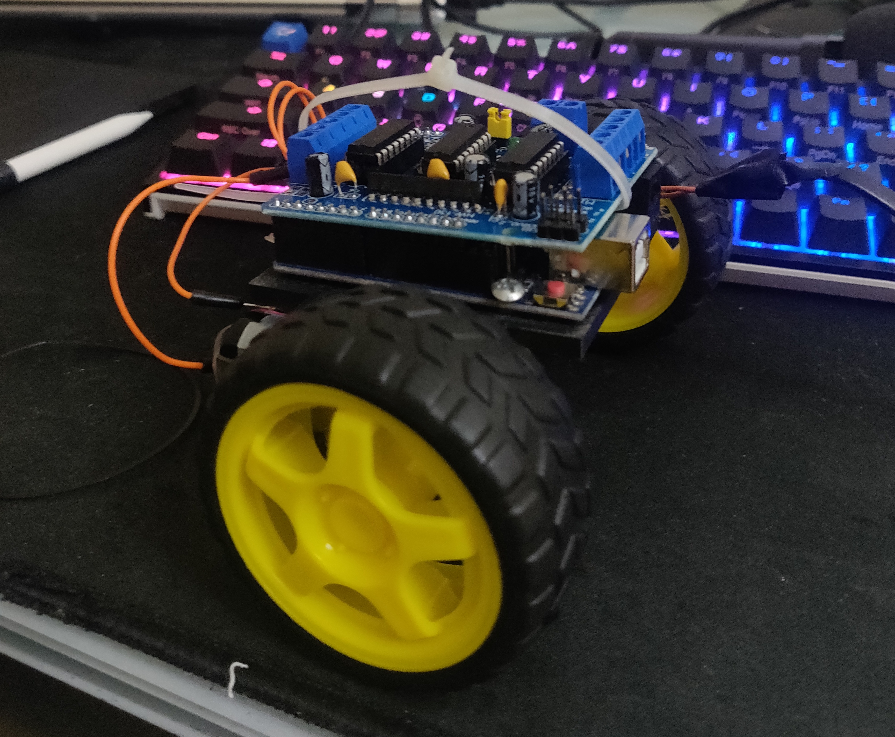

# 3DPrints
A visual repository of my 3d printing journey, applications I've used previously, aswell as currently in the process of learning [Shapr3D](https://www.shapr3d.com/) and [Fusion 360](https://www.autodesk.com/products/fusion-360/overview). 

##### Resources 
This is a list of resources I hope to learn from; 
- http://507movements.com/
- https://www.youtube.com/watch?v=KPDjUchKw1I&ab_channel=Maker%27sMuse

### Table of Contents
1. [Vase Cap](#Vase)
2. [Mic Stand](#Mic)
3. [Robotics Car](#Car)

#### Vase
This is one of my first designs I made on Shapr3D, allows the bamboo sticks to lay in the center and simply sits on top of the vase. I think it's pretty cool, would've been nice to experiment on it with a clearer filament.

#### Mic 
The original mic stand that came with this generic mic, broke off due to its cheaper quality of production, hence I designed one on Shapr3D, as you can see it's fairly simple but works well and is high enough to account for the ouput cable.

#### Car
Whilst this design is quite simple, it was only a demonstration system to see what I could achieve if I gave myself a few hours and with parts I had on hand. Currently it'd only go forward and if coded could do 360 movements on the spot, however I plan on creating a new platform design allowing for additional motors.

My main hope with this would be add in a pi with a LIDAR based sensor once I am able to invest more time and configure it to work with ROS and SLAM based algorithms.  

